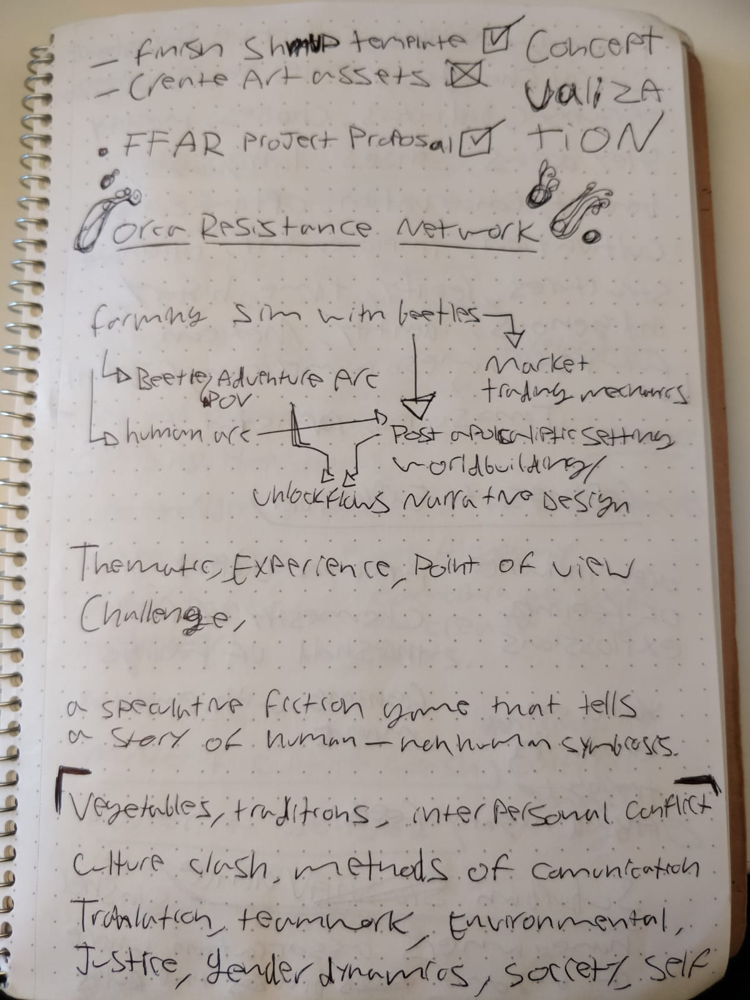
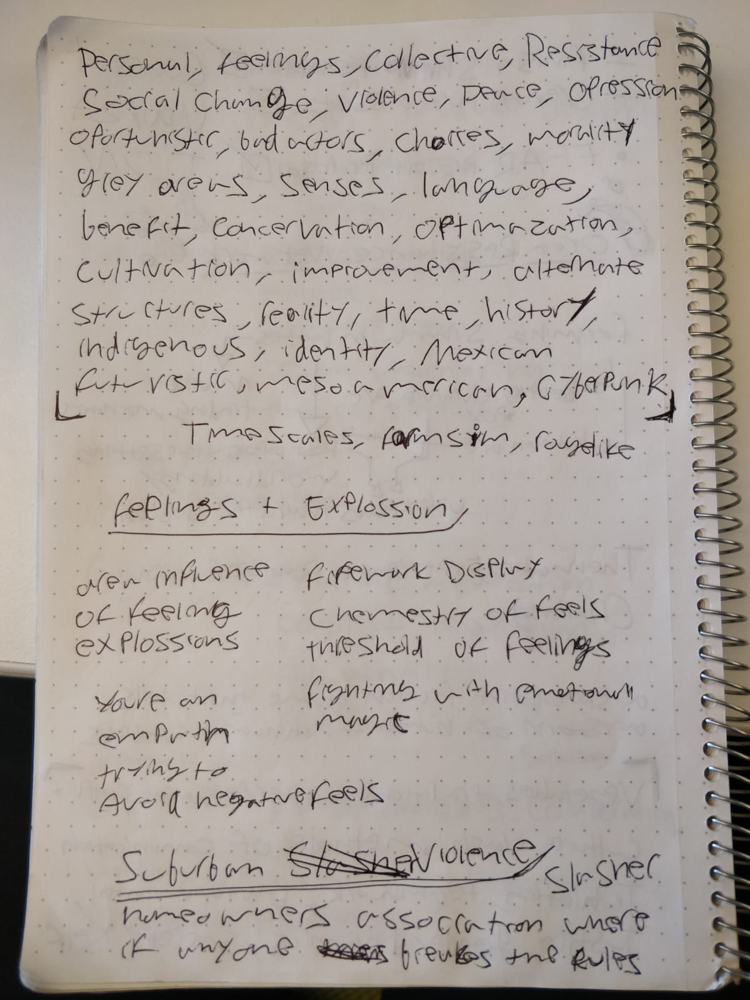
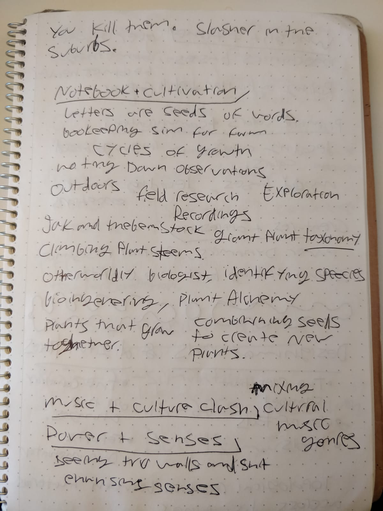
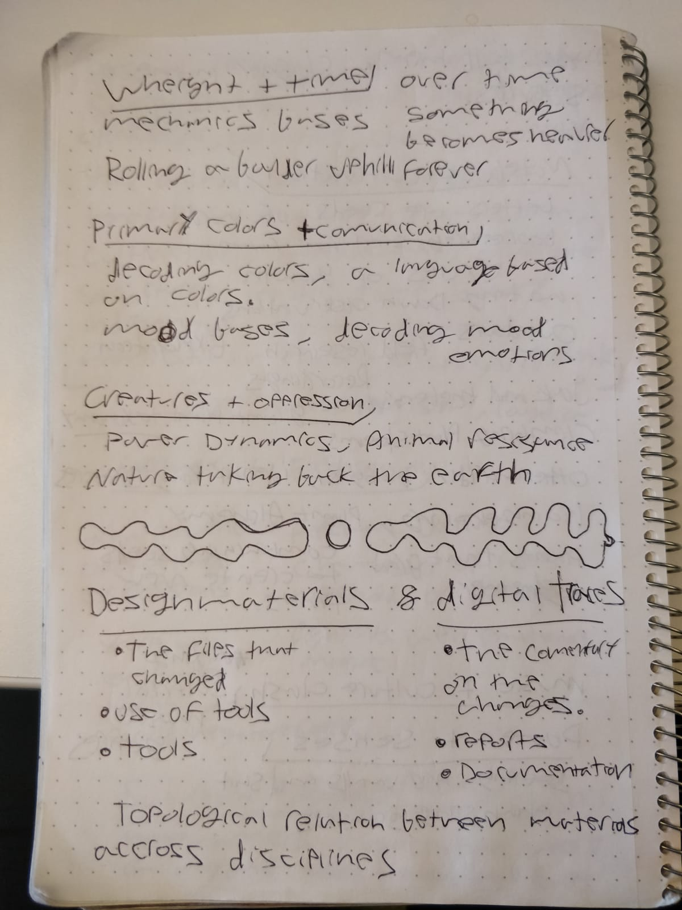

## 03 - Conceptualization | possible tangents in exo-matriz and extra ideation to appease the gods

I spent some time thinking of the different tangents I could take my existing project 'exo-matriz', and prototype in 'units' of distinct features. Some possible options are laied out in my notes that branch from the core concept of the game 'farming sim with beetles'. They are 

- Market trading mechanics (the idea that you could trade the yield of your crops for money and upgrades).
- beetle adventure arc - (a beetle micro traversal of an environment from the POV of a beetle).
- Human arc societal arch (which I see as the main game mode).
- Post-apocalyptic worldbuilding / Narrative systems design. (building up the details of the world and a sort of chapter progression).

Unlock flows are sort-of central to many of these features too.  

I also expanded out into wider concepts trying to generate new and completely different game concepts in class. my favorites are 'Orca Resistance Network', 'Feelings + Explosion' and 'Notebook + Cultivation'.

From now on I will continue my journaling and development in the exo-matriz repo moving forward with 3rd person movement explorations, a sort of platformer for beetle movement. My initial question is purely functional; How do I implement  3d movement in an interesting traversal mechanic context?

- [exo-matriz repo.](https://github.com/lmorv/exo-matrix/tree/main)
- [exo-matriz journal.](https://github.com/lmorv/exo-matrix/blob/main/process/leo-journal.md)

## 02 - Shoot em up Ideation

Biomechanical, main character on foot (maybe), enemies are spores, pixel art.

Tutorial to build on:
- https://www.youtube.com/playlist?list=PL6ynPcXXvDY_9nYW_S-nAliA1w1mARm8x

Style inspiration:
- https://penusbmic.itch.io/sci-fi-platformer-dark-edition
- https://penusbmic.itch.io/the-dark-series-the-ancient-guardian
- https://penusbmic.itch.io/the-dark-series-the-tarnished-widow-boss
- https://penusbmic.itch.io/the-dark-series-shadow-of-storms

## 01 - Cocoon, Returnal & things that came before 

### Concatenated unlock flows
The moment I realized Cocoon's depth, beyond the charming art style and the localized creative environmental puzzles, was when I acquired the ability to travel to a second biome and encountered the same same sort of barrier's that I'd learn to de-activate in the first biome using a drone. The game wanted me to go back to the first world, get a similar drone, and come back to the newly unlocked world to clear my way forward. And it gave the means to do so within a reasonably low effort investment through established mechanics for narratively-wrapped fast travel between worlds. You see, each world that the player unlocks is represented by an orb that they can carry about from one travel portal to another, each progressive travel portal they encounter requires a higher number of world orbs to activate, requiring the player to amass all currently held orbs around the portal. Once activated the portal can be attuned to any orb placed in the middle, allowing the player to jump into the orb to explore the biome held within. 

The environmental puzzles are creatively though out with a variety of mechanics involving the world orbs, supplemented by carefully crafted bio-mechanical animations that bring the built environment to life. The environmental storytelling blends with the puzzle mechanics in a way that ties the player into detailed attention loops at a variety of simultaneous scales all nested inside each other revealing the complexity of the bizarre bio-mechanical reality of the game world.

The following are other terms and thematic threads of game features that I generally enjoy, steaming from the experience of diving into Cocoon, then Returnal, and the thoughts that bubbled up from their approach to genre mechanics in relation to other games, like Hades and the first Doom remake from 2016. Both games that have a very tight gameplay loop and fast-paced action, and in the side of the more 'linear narrative' experience I keep coming back to the fact that Doom felt much more immediate, like a kung-fu movie like The Raid: Redemption, in contrast to it's sequel whose chapters felt much more disconnected from each other. 

- Objective immediacy/ unbroken gameplay experience.
- Immersive efficacy of narrative wrappers.
- Rouge-like justifications for death loop.
- Event progression and cohesive gameplay transitions.